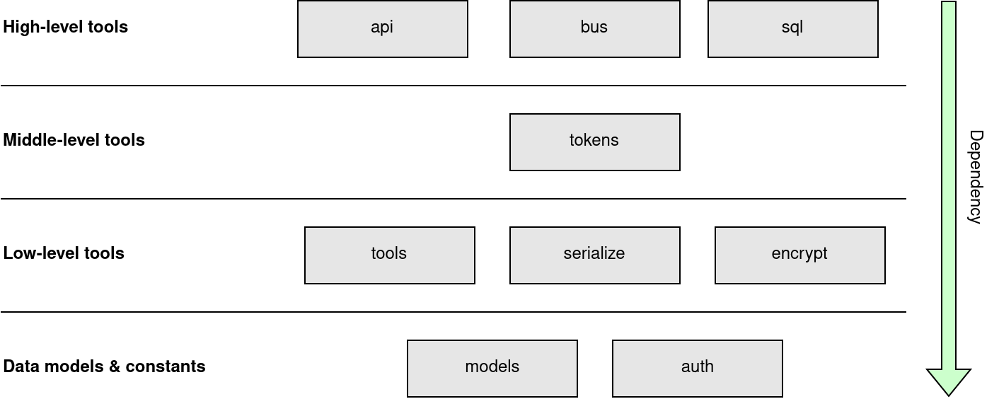
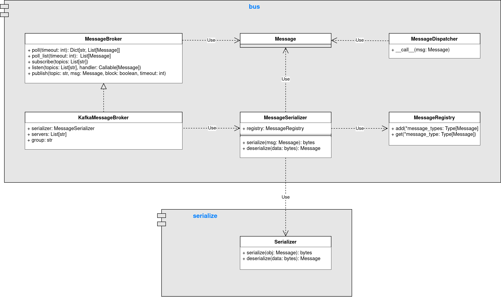

# Background
Platform-Utils is a cross-cutting framework designed for EnergyOrigin with the
purpose to strip microservices from as much boilerplate code as possible. It
provides common implementations - both high- and low-level - available for
services through a PIP package.

---

# Internal architecture
Platform-Utils consists of multiple modules, some of which are dependent on
each other. The diagram below illustrates the layers of Platform-Utils and
the internal dependencies between its modules. Each module is described in
details later on in this article.

---

# Dataclasses
A common theme in Platform-Utils is the use of
[Python dataclasses](https://docs.python.org/3.8/library/dataclasses.html).
They provide a convenient way of defining clear data models, while at the same
time allowing for serializing and deserializing instances of dataclasses to
and from JSON (or other formats). Using third-party libraries such as
[serpyco](https://github.com/grignards/serpyco)
allows performing JSON validation when deserializing from JSON byte-streams
to dataclasses (and vice-versa).

This concept is widely used when, for example, handling HTTP requests to
validate input JSON, or sending or receiving messages from a message bus.

---

# Data models
Data models, that are common across services, have been defined in
Platform-Utils. This allows all services to import and use/reuse the same
models without having to define them multiple times.

Note: When defining global datamodels one must take in consideration that
models has to be backwards compatible, meaning adding fields that are
required, or changing former optional fields to being required, are not
allowed.

---

# Modules
The following sections describe the modules included in Platform-Utils:

## API module
The _api_ module provides an abstraction over the underlying web-framework.
This allows services to implement an HTTP web API without the need 

## BUS module
The _bus_ module provides an easy-to-use interface for publishing and
subscribing to a message bus. The underlying transport layer is abstracted
away for the client, thus the bus technology can be changed without clients
being aware of it.  The current implementation uses
[Apache Kafka](https://kafka.apache.org/) to transport messages.

### Class descriptions

- **MessageBroker** is an abstract class (interface) that allows interaction
  with the message broker.
- **KafkaMessageBroker** is a concrete implementation of MessageBroker,
  and is the only Kafka-specific implementation in Platform-Utils.
- **MessageSerializer** serializes and deserializes messages for the bus (ie.
  dataclasses to JSON and vica-versa).
- **MessageRegistry** contains all valid message types, and is used when
  deserializing messages received from the bus.
- **MessageDispatcher** is a collection of events and their respective handlers.
  It dispatches events to the appropriate handler.

## SQL module
TODO

## Other modules
TODO
